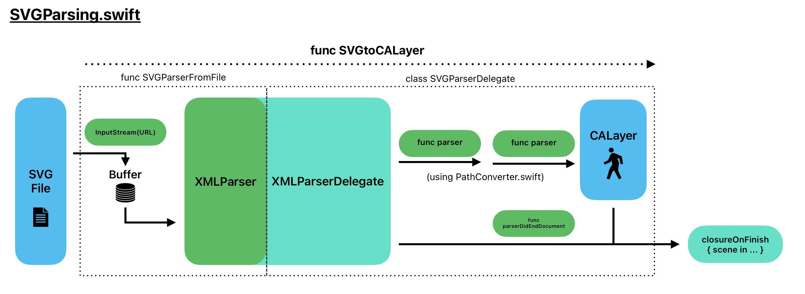

# ``AnimateSVG``

Minimalist, performant, and seamless animation of SVGs. Interprets SVG paths as CGPaths and animates SVG groups as CALayers (QuartzCore).

Quickly apply skeletal animation (rigging) to an SVG character by including the skeleton in the SVG file as a path, and the skeletal structure will be used in building up the CALayers, for instant ability to animate within the skeletal rig.

## API Overview

Supported SVG files have a limited structure (groups of paths, specific id's) that allows the framework to interpret it as animatable. The library can be used to automatically create an animation of a character, with only data to rotate the limbs being needed for a performant and resolution-independent skeleton animation. The library is intended for, but not limited to, the modern SwiftUI framework.

// ADD IMAGE (HIGH LEVEL OVERVIEW) --------------------------------WAIT TO IMPROVE IMPLEMENTATION ----------------------------------------------------

The library parses the SVG data of a file, creates Core Graphics paths for each group in the SVG and displays them on Core Animation layers. If given a skeleton structure as an input in the API and the SVG having a designated path of the skeleton joints, then the Core Animation layers are automatically built up as given by the skeleton structure and the corresponding CGPaths are displayed attached to the layers for seamless animation.

### SwiftUI Integration

The recommended way to access the framework is through the dedicated SwiftUI View:

> SVGAnimationView(svgURL: _)

with the svgURL being Foundation's URL struct of a file with extension '.svg'. The view, with no further inputs, will display the SVG as a resolution independent image scaled to the size of the frame. Therefore, this library can be used as an SVG to Core Graphics renderer also.

### If you prefer UIKit View

## Possible Improvements for Later

### High priority:

- Add to supported commands: v,V, h, H for example

### Low priority:

- A concurrent method of building the skeleton of CALayers and drawing the paths on the layers.

## Implementation Details

### Parsing SVG

Parsing is done using an implementation of Foundation's XMLParser with InputStream. This is written in SVGParsing.swift and the methods of drawing the CGPaths are in PathConverter.swift. By default, the main CALayer is built with a buffered series of instructions:

