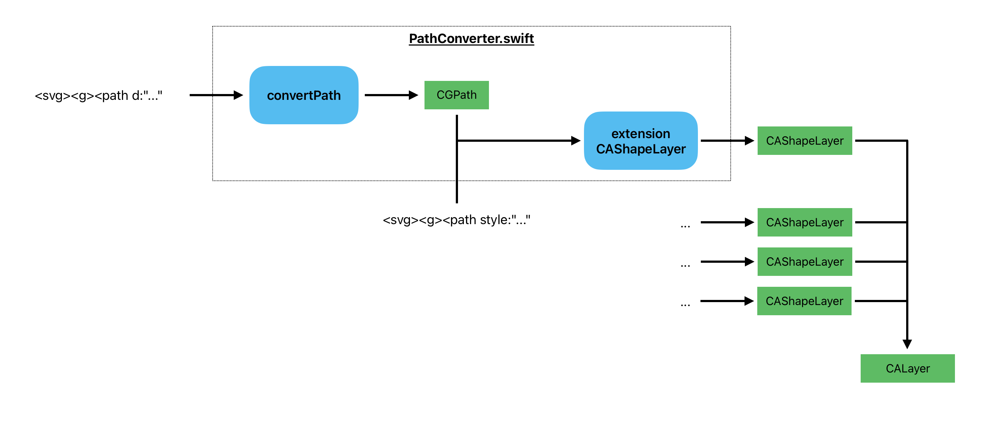
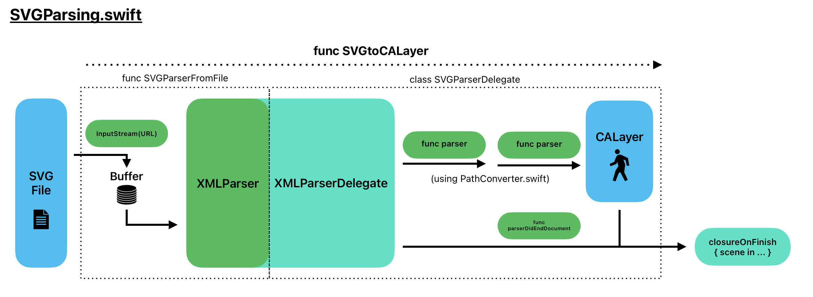

# Implementation

Mid-level overview of how the framework works.

The library parses the SVG data of a file, creates Core Graphics paths for each path in the SVG, a group in the SVG corresponds to a superlayer CALayer in CoreAnimation. If given a skeleton structure as an input and the SVG including a drawing of the skeleton, then the Core Animation layers are related to each other as in the skeleton structure and only rotations of the joints are needed for full animation.

### Interpreting SVG Paths

Every SVG path with attributes `"d"` and `"style"` creates a CAShapeLayer:



The `"id"` attribute of the path sets the `name` of the CAShapeLayer, and if the path has a `"transform"` attribute, an analogous transformation is added to the CAShapeLayer.

> Warning: Only CSS style instructions are parsed, and only the style attributes fill, stroke color and stroke width are currently used.

*Possible future improvements:*
- *Add path commands v, V, h, H,*
- *Add more style attributes which have analogies in CGPath*
- *Add non-CSS style commands, which overwrite any CSS style commands.*

### Parsing SVG

Parsing is done using an implementation of Foundation's [XMLParser](https://developer.apple.com/documentation/foundation/xmlparser/) with [InputStream](https://developer.apple.com/documentation/foundation/inputstream/). 

The start of a group element in the SVG initializes a CALayer, with the group's `"id"` attribute becoming the `name` of the layer. The id/name can then be used to direct animation of that specific component.

Any new groups within become CALayers within CALayers, and paths in the groups become CAShapeLayers. All the positioning and transformations are handled appropriately.

The main CALayer is built with a buffered series of instructions:



*Possible future improvements: Implement concurrent method of loading layers.*

### Parsing SVG with Skeleton

Skeleton structure is given by a DAG with a source joint being the input. For example, the skeleton structure:


is given as the tree:

```swift
let skeleton =
Joint(id: 11, directedChildren:
		[Joint(id: 10, directedChildren:
				[Joint(id: 1, directedChildren:
						[Joint(id: 0, directedChildren: []),
						 Joint(id: 2, directedChildren:
								[Joint(id: 4, directedChildren:
										[Joint(id: 6, directedChildren:
												[Joint(id: 8, directedChildren: [])])])]),
						 Joint(id: 3, directedChildren:
								[Joint(id: 5, directedChildren:
										[Joint(id: 7, directedChildren:
												[Joint(id: 9, directedChildren: [])])])])])]),
		 Joint(id: 12, directedChildren: [
			Joint(id: 14, directedChildren: [
				Joint(id: 16, directedChildren: [
					Joint(id: 18, directedChildren: [])])])]),
		 Joint(id: 13, directedChildren: [
			Joint(id: 15, directedChildren: [
				Joint(id: 17, directedChildren: [
					Joint(id: 19, directedChildren: [])])])])])
```

> Warning: For the skeleton mode, the SVG should be structured as only containing groups of paths (no higher level groups). Paths outside groups will be ignored for rendering.

In addition, the positions of the joints relative to the SVG are needed:

These are given by a path in the SVG with `id="skeletonPath"`, which is not rendered in the animation and is only used for the data. The path should have the same number of points as the number of joints in the skeleton, and the position of the `n`th point in the path, will be the understood position of the joint with `id: n` . 

Example in Inkscape for the previous skeleton structure:


> Warning: Currently, the skeleton path is assumed to not have any transformation attributes. It is best to not include it in a group.

The parser builds the CALayers without attachment first, handling any transformations in the SVG components as affine transformations on the layers. At the end of parsing the document, it uses the `skeletonPath` and the source `Joint` to build the CALayer structure recursively.


### Displaying SwiftUI View

To display the animation as a SwiftUI View, we use a UIViewRepresentable to have UIKit intermediate between SwiftUI and Core Animation, which is required since there's no official dedicated View for Core Animations in SwiftUI. There is a View for SpriteKit scenes, but SpriteKit has less functionality and low level control than Core Animation.


